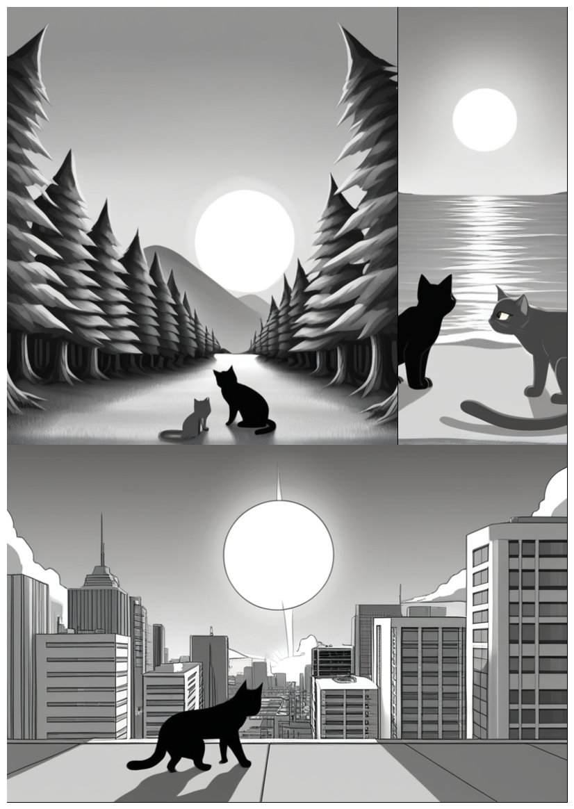

# manga_generator
Create your manga/comic with manga_generator and Stable Diffusion XL(with Gradio UI)

# Installation:
1. Install [Python 3.10.6](https://www.python.org/downloads/release/python-3106/), checking "Add Python to PATH".
2. Install [git](https://git-scm.com/download/win).
3. On terminal:
```bash
git clone https://github.com/shiroppo/manga_generator
cd manga_generator
py -m venv venv
.\venv\Scripts\activate
pip install -r requirements.txt
```

# manga_generator.txt
File with prompts, one line = one prompt(1 scene)  
one empty line = new page  
(max 6 scenes for page)  

# env/manga_generator.env
File for configuration

# Models
If you have webui 1111 or similars you can insert your PATH in env/manga_generator.env after MAIN_DIR= and configure the other options  
or  
1. Download from hugginface, civitai.com or any similar website every checkpoint sd xl that you use and put them into ./models/Stable-diffusion/
2. (optional) Download from hugginface, civitai.com or any similar website every LoRA sd xl that you use and put them into ./models/Lora/
3. (optional) Download from hugginface, civitai.com or any similar website every VAE that you use and put them into ./models/VAE/
4. Configure the env/manga_generator.env with your models

# Run:
### Method 1
Double click on ```app.bat``` on manga_generator directory
### Method 2
On terminal:
```bash
.\venv\Scripts\activate
py app.py
```
# Update:
1. ```git pull```(if error: ```git stash``` and after ```git pull```)
2. ```.\venv\Scripts\activate```
3. ```pip install -r requirements.txt```

# Example
```bash
greyscale,1 cat,day,sun
greyscale,1 cat,day,sun,forest
greyscale,1 cat,day,sun,city
```


# Greyscale
Add ```greyscale``` at the start of every lines

# Black and White
Add ```monochrome``` at the start of every lines

# Balloon in this application
For the Baloon, the best option is to insert them manually, you can try to insert ```balloon``` in the prompt, but Stable Diffusion XL is not so good with balloon and text inside them.

# Versions:
- v1.0: First version

## Support:
- ko-fi: (https://ko-fi.com/shiroppo)
